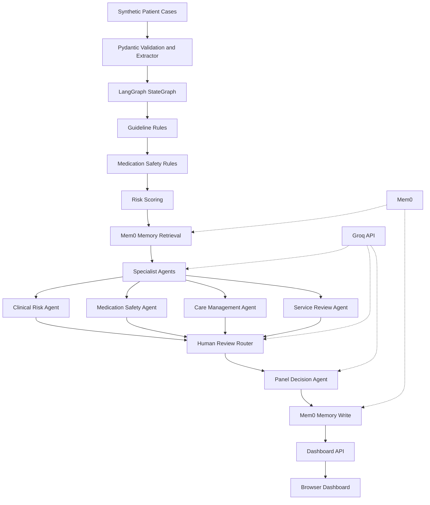

# Healthcare Multi-Agent Case Review Pipeline

## One-Line Project Description

Build a multi-agent healthcare case review pipeline that extracts patient data, checks clinical rules, assesses risk, flags medication/guideline issues, routes high-risk cases to human review, and generates an auditable care summary.

## Project Overview

This project adapts a multi-agent review architecture to healthcare. The goal is to support clinical case review, care-gap analysis, prior authorization review, medication safety review, or patient risk triage.

The system should act as a clinical decision-support assistant, not an autonomous diagnosis or treatment engine. It should summarize evidence, flag risks, apply deterministic rules where possible, and escalate high-risk or low-confidence cases to a human clinician.

## Building Blocks

### 1. Patient Record Input

Ingests healthcare documents and structured data such as:

- Clinical notes
- Lab reports
- Medication lists
- Diagnoses
- Allergies
- Prior visits
- Imaging summaries
- Prior authorization requests
- Discharge summaries

### 2. Clinical Extractor

Uses deterministic Python extraction and Pydantic validation to normalize synthetic case records into a clean schema. In a production version, this same step could be extended with LLM-assisted extraction for messy source documents.

Example schema:

```python
class PatientCase(BaseModel):
    patient_age: int
    sex: str
    diagnoses: list[str]
    medications: list[str]
    allergies: list[str]
    lab_results: dict[str, float]
    symptoms: list[str]
    recent_visits: list[str]
    requested_service: str | None
```

Purpose:

```text
Raw clinical text -> structured patient case
```

### 3. Guideline / Policy Check

Runs deterministic Python rules for items that should not depend on LLM judgment.

Examples:

- Required labs are present
- Patient meets age-based screening criteria
- Medication is contraindicated for a known allergy
- Required prior authorization documentation is present
- Abnormal lab thresholds are flagged
- Duplicate therapy is detected
- Coverage policy criteria are met or missing

This should be LLM-free where possible because hard rules need deterministic behavior.

### 4. Clinical Risk Analyst

Uses an LLM with structured output to interpret the patient case qualitatively.

It can assess:

- Clinical severity
- Red flags
- Care gaps
- Possible follow-up needs
- Overall risk level
- Missing information

Example output:

```python
class ClinicalRiskAnalysis(BaseModel):
    summary: str
    severity: Literal["low", "medium", "high"]
    red_flags: list[str]
    care_gaps: list[str]
    confidence: float
```

### 5. Medication Safety Agent

Checks medications against allergies, duplicate therapies, high-risk combinations, and patient-specific risk factors.

This can combine:

- Deterministic rules
- Drug interaction tools
- LLM explanation layer

Example checks:

- Drug-allergy conflict
- Duplicate medication class
- Age-specific medication concern
- High-risk medication combination
- Missing monitoring lab

### 6. Risk Quantifier

Uses tool-based scoring functions to produce numeric risk scores.

Example tools:

```python
calc_readmission_risk(patient_case) -> float
calc_medication_safety_risk(patient_case) -> float
calc_care_gap_risk(patient_case) -> float
```

Purpose:

```text
Qualitative case data -> numeric risk scores
```

### 7. Synthesizer

Combines all specialist outputs into a single clinical decision-support summary.

Inputs:

- Structured patient case
- Guideline/policy result
- Clinical risk analysis
- Medication safety result
- Quantified risk scores

Output:

```python
class ClinicalPanelDecision(BaseModel):
    decision: Literal["Routine", "Needs Follow-Up", "Urgent Review", "Insufficient Data"]
    confidence: float
    rationale: str
    recommended_actions: list[str]
    escalate_to_human: bool
```

### 8. Human Review

Routes cases to clinician review when needed.

Escalation triggers:

- High clinical risk
- Low confidence
- Possible medication safety issue
- Urgent abnormal lab
- Missing critical data
- Coverage denial recommendation
- Any safety-critical recommendation

### 9. Report Generator

Produces a structured, auditable report.

Sections:

- Patient Case Summary
- Extracted Data
- Guideline / Policy Check
- Clinical Risk Analysis
- Medication Safety Findings
- Risk Scores
- Final Recommendation
- Human Review Notes
- Audit Log

## Technical Components

Recommended stack:

```text
Python
LangGraph
Pydantic schemas and structured outputs
Synthetic JSON dataset
Pure Python rules engine
Tool functions for risk scoring
Groq-backed LLM agents for interpretation
Human-in-the-loop routing
Mem0 long-term memory with local JSON fallback
Python stdlib dashboard API
Browser dashboard for audit trail
```

## Architecture Diagram

Mermaid version:



Plain-text version:

```text
Synthetic Patient Cases
        |
        v
Pydantic PatientCase Validation
        |
        v
Extractor
normalize case, labs, vitals, medications, note signals
        |
        v
LangGraph StateGraph
shared CaseReviewState
        |
        v
+----------------------+------------------------+
|                      |                        |
v                      v                        v
Guideline Rules        Medication Safety        Risk Scoring
deterministic          deterministic            numeric risk scores
        |                      |                        |
        +----------------------+------------------------+
                               |
                               v
Memory Retrieval
Mem0 if configured, local JSON fallback
prior similar decisions and reviewer patterns
                               |
                               v
Specialist Agents
Groq LLM when configured, deterministic fallback otherwise
retrieved memory is advisory context
        |
        +--> Clinical Risk Agent
        +--> Medication Safety Agent
        +--> Care Management Agent
        +--> Service Review Agent
        |
        v
Human Review Router
LLM route + deterministic safety baseline + routing guardrails
chooses clinician, pharmacist, care manager, or clinical reviewer
        |
        v
Panel Decision
LLM panel decision + deterministic safety baseline + panel guardrails
        |
        v
Memory Write
store final case pattern, risk signals, route, and panel decision
        |
        v
Final Case Decision JSON
        |
        v
Dashboard API /api/cases and /api/case?id=...
        |
        v
Browser UI Dashboard
case list, decision trail, risk scores, routing, agent outputs, memory trace

.env provides GROQ_API_KEY for LLM calls and MEM0_API_KEY for memory. OpenAI and Ollama remain optional provider paths.
.gitignore protects .env from being committed.
```


## Core Flow

```text
1. Ingest patient record.
2. Extract structured patient data.
3. Run deterministic guideline and policy checks.
4. Run deterministic medication safety checks.
5. Run tool-based risk scoring.
6. Retrieve relevant prior case memory from Mem0.
7. Run specialist agents with current case context plus retrieved memory.
8. Run the human review router to choose reviewer role and urgency.
9. Generate the guarded panel decision.
10. Store the finalized case pattern back into Mem0.
11. Display the auditable decision trail in the dashboard.
```

## Design Decisions

### Graph Nodes Instead of One Big Chain

LangGraph separates the workflow into explicit nodes: guideline checks, medication safety, risk scoring, memory retrieval, specialist agents, human review routing, panel decision, and memory write. This makes the decision trail easier to debug and explain.

### Pydantic Structured Output Instead of Free Text

LLM outputs are validated with Pydantic models. This keeps agent responses machine-readable and prevents the dashboard from depending on fragile free-form text parsing.

### Deterministic Rules for Safety and Policy

Medication allergy conflicts, missing labs, and coverage criteria should use deterministic rules when possible. LLMs can explain results, but should not be the source of truth for hard rules.

### Tool-Based Risk Quantification

Risk scores should come from explicit functions or validated models, not free-form LLM guesses.

### Human-in-the-Loop for Safety

High-risk, low-confidence, or safety-critical cases should pause for clinician review.

### Memory as Advisory Context

Memory is used to recall prior case patterns, reviewer preferences, and finalized decisions. It is retrieved before the specialist agents and written after the panel decision. It does not replace current case data, deterministic safety checks, or panel guardrails.

The implementation supports:

- `MEMORY_PROVIDER=local` for a demo-friendly JSON memory store
- `MEMORY_PROVIDER=mem0` for Mem0-backed long-term memory when `MEM0_API_KEY` is configured

Current demo configuration uses `MEMORY_PROVIDER=mem0` and `MEM0_USER_ID=roja-healthcare-demo`.

### Auditability

Every extracted field, specialist output, decision, and human review action should be stored for traceability.

## Safety and Compliance Notes

This system should be treated as clinical decision support.

It should not:

- Diagnose autonomously
- Prescribe treatment independently
- Replace clinician judgment
- Hide uncertainty
- Store PHI insecurely

Production requirements would include:

- HIPAA-aware storage
- Access control
- Encryption
- Audit logs
- PHI minimization
- Clinical validation
- Human review workflows
